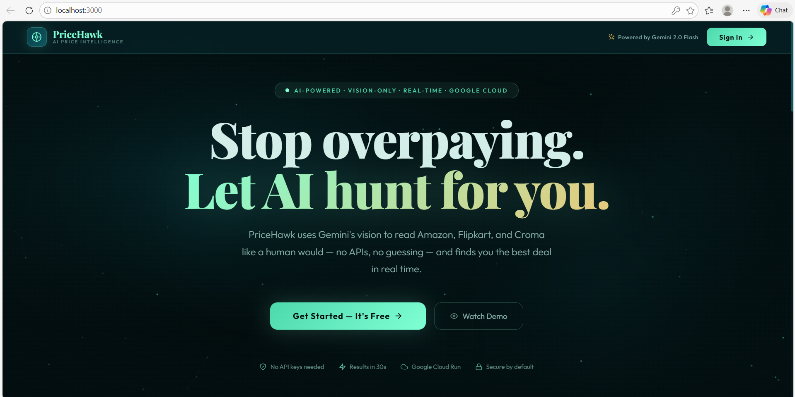
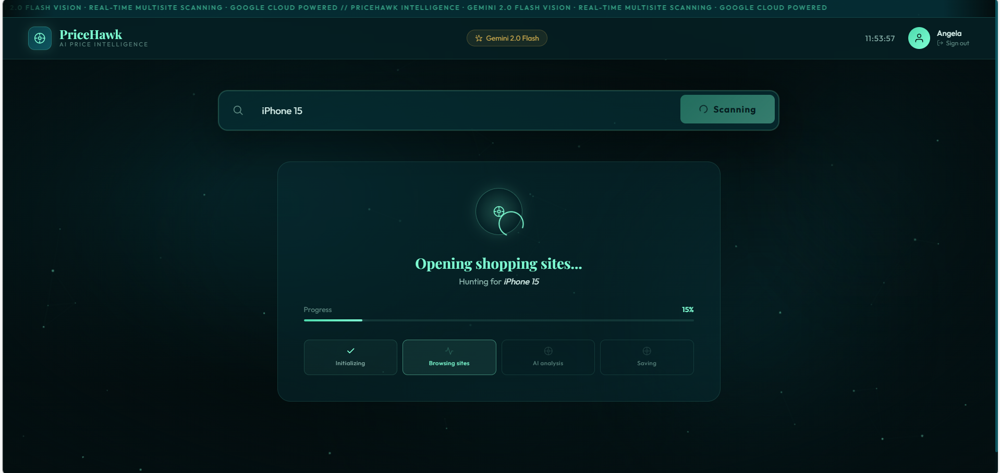
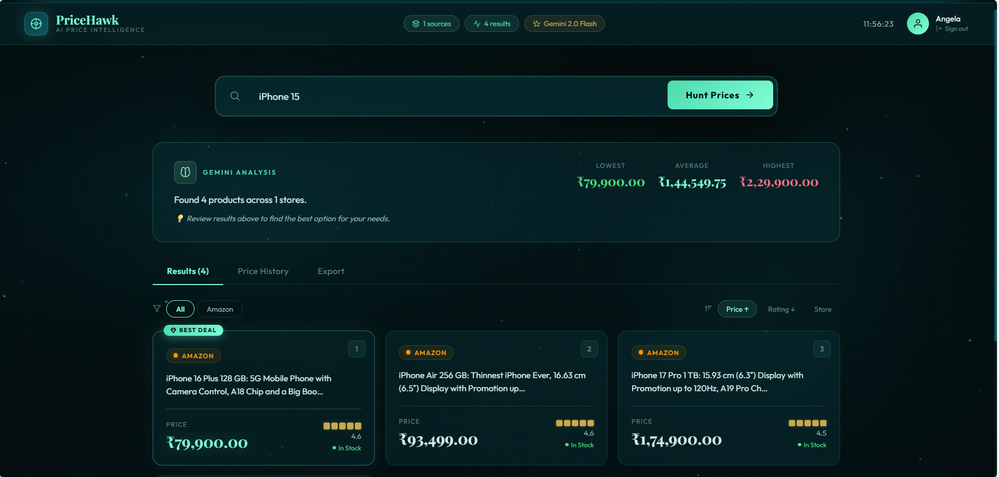
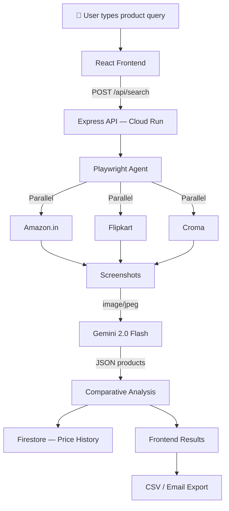

<div align="center">

# PriceHawk — AI Price Intelligence Agent

**Find the best deal across Amazon, Flipkart & Croma in real time.**  
</div>

## Screenshots

### Landing Page


## Application Dashboard


## Results Page


## 🦅 What is PriceHawk?

PriceHawk is a next-generation AI shopping agent that **visually navigates real browser sessions** to find the best product prices — completely without using any retailer APIs.

Instead of calling official APIs or hardcoded scrapers, PriceHawk:
1. Deploys **Playwright** to open real headless Chrome browser tabs
2. Sends screenshots to **Gemini 2.0 Flash** which reads them like a human would
3. Extracts prices, titles, and ratings using **multimodal AI vision**
4. Uses Gemini to **rank results** and deliver an intelligent recommendation

```
User: "iPhone 15"
  ↓
PriceHawk opens Amazon.in, Flipkart, and Croma simultaneously
  ↓
Screenshots captured → sent to Gemini 2.0 Flash
  ↓
Gemini reads pixels → extracts structured product data
  ↓
Gemini compares all products → ranks best deal + top rated
  ↓
Results displayed in real time within ~30 seconds
```

---

## ⚙️ How It Works



---

## ✨ Features

### 🤖 Core Agent
| Feature | Description |
|---|---|
| **Vision-Only Extraction** | Gemini 2.0 Flash reads screenshots — no DOM dependency, no brittle CSS selectors |
| **Multi-Site Parallel Scan** | Amazon, Flipkart & Croma opened simultaneously via `Promise.allSettled()` |
| **AI Price Analysis** | Gemini identifies Best Deal, Top Rated, generates recommendation with insights |
| **Relevance Filtering** | Products filtered by query keyword match — no irrelevant sponsored results |
| **Live Progress Tracking** | Real-time 4-stage pipeline display with animated progress bar |

### 📊 Results & Export
| Feature | Description |
|---|---|
| **Price Comparison Grid** | Cards with store badges, ratings, availability, Best Deal / Top Rated labels |
| **Price History Chart** | SVG line chart built from Firestore data across multiple searches |
| **CSV Download** | Export all results as a spreadsheet instantly |
| **Email Export** | Send results to any email via Nodemailer |

### 🎨 UI
| Feature | Description |
|---|---|
| **Landing Page** | Full marketing homepage with features, how-it-works, CTA |
| **Sign In / Sign Up** | Glassmorphism modal with session persistence via localStorage |
| **Mission Control Design** | Deep teal + aquamarine palette, animated smoke background, particle canvas |
| **Custom SVG Icon Library** | 25+ hand-crafted inline SVG icons — no icon library dependency |
| **Playfair Display + Outfit** | Premium serif + modern sans font pairing |

---

## 🛠️ Tech Stack

| Layer | Technology | Purpose |
|---|---|---|
| **AI Vision** | Gemini 2.0 Flash via `@google/genai` | Screenshot reading, product extraction, deal ranking |
| **Browser Agent** | Playwright (Chromium headless) | Real browser automation, DOM extraction fallback |
| **Backend** | Node.js 20 + Express.js | REST API, async job orchestration |
| **Frontend** | React 18 + Vite | Real-time UI, price charts, export controls |
| **Database** | Google Cloud Firestore | Price history persistence, result caching |
| **Hosting** | Google Cloud Run | Serverless container deployment |
| **Email** | Nodemailer (Gmail SMTP) | Export results by email |
| **Containers** | Docker | Reproducible GCP deployment |

---

## 🏗️ Architecture


**Google Cloud Services used:**
- **Cloud Run** — Backend API + Frontend both deployed as containers
- **Firestore** — NoSQL database for price history and search caching
- **Container Registry** — Docker image storage
- **Secret Manager** — API keys and credentials

---

## 🚀 Quick Start (Local)

### Prerequisites

- [Node.js 20+](https://nodejs.org)
- [Git](https://git-scm.com)
- A free Gemini API key from [Google AI Studio](https://aistudio.google.com)

### 1. Clone the repository

```bash
git clone https://github.com/YOUR_USERNAME/pricehawk.git
cd pricehawk
```

### 2. Set up the backend

```bash
cd backend

# Install dependencies
npm install

# Install Playwright browser
npx playwright install chromium

# Copy environment template
cp .env.example .env
```

Edit `backend/.env`:

```env
GEMINI_API_KEY=your_gemini_api_key_here
GCP_PROJECT_ID=your_gcp_project_id
EMAIL_USER=your@gmail.com
EMAIL_PASS=your_gmail_app_password
PORT=8080
```

> **Get a free Gemini API key:**  
> 1. Go to [aistudio.google.com](https://aistudio.google.com)  
> 2. Click **Get API Key** → **Create API key**  
> 3. Free tier: 15 requests/minute, 1,500/day

### 3. Set up the frontend

```bash
cd ../frontend
npm install
```

### 4. Run both servers

Open **two terminals**:

```bash
# Terminal 1 — Backend
cd backend && npm run dev

# Terminal 2 — Frontend 
cd frontend && npm run dev
```

## 📁 Project Structure

```
pricehawk/
│
├── backend/
│   ├── src/
│   │   ├── index.js              # Express server entry point
│   │   ├── routes/
│   │   │   ├── search.js         # POST /api/search — main agent endpoint
│   │   │   ├── export.js         # POST /api/export/email + /csv
│   │   │   └── history.js        # GET /api/history — price trends
│   │   └── services/
│   │       ├── gemini.js         # Gemini AI calls + response caching
│   │       ├── browser.js        # Playwright shopping agent (Amazon/Flipkart/Croma)
│   │       └── firestore.js      # Google Cloud Firestore persistence
│   │
│   ├── Dockerfile                # Multi-stage Docker build with Chromium
│   ├── .env.example              # Environment variable template
│   └── package.json
│
├── frontend/
│   ├── src/
│   │   ├── App.jsx               # Complete React app (landing + auth + dashboard)
│   │   └── main.jsx              # React entry point
│   │
│   ├── Dockerfile                # Nginx-based production build
│   ├── nginx.conf                # SPA routing config
│   └── package.json
│
├── docs/
│   └── architecture.svg          # System architecture diagram
│
├── deploy.sh                     # One-command GCP deployment script
└── README.md
```

## 🔬 Findings & Learnings

### Technical Challenges

**Bot detection is aggressive**  
All three major e-commerce sites detect headless browsers. Solved with realistic `User-Agent` strings, randomized delays between 800–3500ms, per-site isolated browser contexts (fresh cookies/session), and `--disable-blink-features=AutomationControlled`.

**DOM structures change constantly**  
Amazon alone has 6+ different title selector patterns across its layouts. The solution: loop through all `<span>` elements inside `<h2>` and pick the longest one — which is always the full product title regardless of layout version.

**Gemini free tier quota**  
The free tier (15 req/min, 1500/day) gets exhausted quickly when sending large screenshots. Solved with: MD5-based screenshot caching (same image = same result), automatic fallback from `gemini-2.0-flash` → `gemini-1.5-flash` (separate quota pool), and a pure-JavaScript analysis fallback that works with zero Gemini calls.

**India-specific deployment**  
Running from India, US sites like eBay and Walmart immediately serve CAPTCHA pages. Indian stores (Flipkart, Croma) are far more accessible from Indian IPs and provide INR pricing which is actually more useful for Indian users.

### Key Learnings

- **Hybrid extraction beats pure vision**: DOM parsing is fast and quota-free; Gemini vision is resilient when selectors break. Using DOM as primary with Gemini as fallback gives the best of both worlds.
- **`Promise.allSettled()` is essential**: Running all scrapers in parallel with graceful failure handling reduces total search time from ~90s to ~30s while ensuring one blocked site doesn't kill the entire search.
- **UX must compensate for latency**: Cloud Run cold starts + browser automation = 20–40s wait times. The animated 4-stage pipeline makes this feel intentional and actually builds anticipation.
- **Price validation is non-trivial**: Without tight price bounds ($1–$15,000), scrapers grab bundle prices, subscription totals, and random numbers on the page. Every extracted price needs sanity checking.


## Demo Video

[![Watch the Demo]](https://youtu.be/v0wLLktL9HI)


---

## 📜 License

MIT License — see [LICENSE](LICENSE) for details.

---

<div align="center">


*PriceHawk — UI Navigator Category · Real-time Vision Agent · No Retailer APIs*

</div> 
